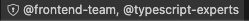

# CODEOWNERS Visualizer

<p align="center">


[](https://github.com/cmtrounce/codeowners-tree/actions/workflows/test.yml)
[](https://marketplace.visualstudio.com/items?itemName=cmtrounce.codeowners-visualizer)
[](LICENSE)

</p>

## ✨ Features

### 📝 CODEOWNERS File Support

- Full syntax highlighting for CODEOWNERS files
- Support for complex glob patterns (`*.js`, `**/logs`, `{js,ts}`, `[abc]`)
- Quoted paths with spaces, escaped spaces, special characters
- Auto-completion for team names and email addresses
- Auto-discovery of CODEOWNERS files in root, `.github/`, `docs/`


### 👥 Team Management

- Pin frequently used teams for quick access
- See which teams own which parts of your codebase
- GitHub team integration with direct links
- Team coverage analysis and reporting


### 📊 Status Bar Integration

- Shows CODEOWNERS coverage directly in the VS Code status bar
- Indicates when files are not covered by any CODEOWNERS rule

| State | Description | Example |
|-------|-------------|---------|
| **No Coverage** | File not covered by any CODEOWNERS rule |  |
| **Single Owner** | File owned by one team/person |  |
| **Multiple Owners** | File owned by multiple teams/people |  |

### 🌳 Interactive Tree Visualization

- Generate beautiful tree-like graphs of your codebase ownership
- Interactive zoom, pan, and search functionality
- Export as SVG for documentation
- Real-time updates as you modify CODEOWNERS files


### 🌍 Localization Support

- Built-in localization for English, Spanish, French, Italian
- Easy extensibility for additional languages
- Consistent experience across all supported languages

## 🚀 Quick Start

### 1. Install Extension & Graphviz

Install from [VSCode Marketplace](https://marketplace.visualstudio.com/items?itemName=cmtrounce.codeowners-visualizer) and run:
- **macOS/Linux:** `brew install graphviz` or `sudo apt-get install graphviz`
- **Windows:** Download from [Graphviz website](https://graphviz.gitlab.io/download/)

### 2. Start Visualizing

Open a workspace with a `CODEOWNERS` file and click any team in the "CODEOWNERS Teams" panel.

## 🎮 Available Commands

Access via Command Palette (`Cmd/Ctrl + Shift + P`) - search for "CODEOWNERS":

- **Open Graph** - Visualize ownership for current workspace
- **Analyze Coverage** - Generate coverage analysis report
- **Export Coverage** - Export coverage data to CSV
- **Create CODEOWNERS File** - Generate a new CODEOWNERS file

*Most commands are also available via right-click context menus and the CODEOWNERS Teams panel.*

## ⚙️ Configuration

Configure in VS Code Settings (`Cmd/Ctrl + ,`):
- `codeownersTeams.showStatusBar` - Show current file's owner in status bar
- `codeownersTeams.showHoverInfo` - Show owner info on file hover  
- `codeownersTeams.pinnedTeams` - Array of team names to pin at top

## 🛠️ Development

```bash
git clone https://github.com/cmtrounce/codeowners-tree.git
cd codeowners-tree
npm install
npm run compile
npm test
```

See [Contributing Guide](CONTRIBUTING.md) for details.

## 🤝 Contributing

Contributions welcome! See [Contributing Guide](CONTRIBUTING.md) for details.

## 📄 License

MIT License - see [LICENSE](LICENSE) file for details.

## 🙏 Credits

Based on the original [CODEOWNERS Tree](https://github.com/a-ignatev/codeowners-tree) by Andrei Ignatev.

---

<p align="center">

**Made with ❤️ for the VSCode community** | [Support this project](https://buymeacoffee.com/cmtrounce)

</p>
